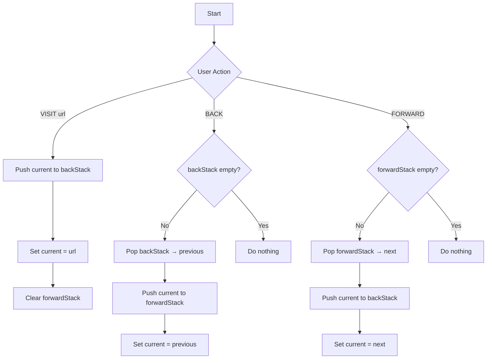

# Browser Navigation System - Technical Report

## 1. Title Page
**Project Title**: Browser Navigation System  
**Topic**: Stack Data Structure Implementation  
**Course**: [Course Name]  
**Group Members**:
- Sreehari S (PRN: 25030421045)
- Ayush Waghmare (PRN: 25030421006)  
**Date**: 2026-05-02  
**Instructor**: [Instructor Name]

---

## 2. Problem Statement
Design and implement a system to simulate web browser navigation history using stack data structures. The system should allow users to visit web pages, navigate backward through their history, and move forward to previously visited pages. This simulation demonstrates the Last-In-First-Out (LIFO) behavior of stack data structures in a real-world scenario.

---

## 3. Objectives
1. Understand and implement stack data structures in TypeScript
2. Simulate browser navigation behavior (back/forward)
3. Create a user-friendly GUI using React and Shadcn UI
4. Demonstrate proper stack operations (push, pop)
5. Validate user inputs and handle edge cases
6. Deploy the application to a cloud platform (Vercel)

---

## 4. System Design / Approach

### 4.1 Representation of Input
- **URL Input**: String representing web page URL
- **Validation**: Must be non-empty, valid URL format (http/https)
- **Auto-correction**: Adds `https://` prefix if missing

### 4.2 Data Structures Used
**Stack (LIFO - Last In First Out)**
- **Back Stack**: Stores history of visited pages for backward navigation
- **Forward Stack**: Stores pages for forward navigation after going back

```typescript
// Stack implementation using TypeScript arrays
type Stack = string[]
let backStack: Stack = []
let forwardStack: Stack = []
```

**Stack Operations**:
- `push(item)`: Add to end of array
- `pop()`: Remove from end of array
- `peek()`: View last item without removing

### 4.3 Overall Logic Flow



### 4.4 Block Diagram
```
+-------------------+
|   User Interface  |
| (URL Input, Btns) |
+---------+---------+
          |
          v
+-------------------+
|  NavSimulator     |
|  (State Manager)  |
+---------+---------+
          |
    +-----+-----+
    |           |
    v           v
+---+---+   +---+---+
| Back  |   |Forward|
| Stack |   | Stack |
+-------+   +-------+
```

---

## 5. Implementation Details

### 5.1 Programming Language
- **Frontend**: TypeScript (strict mode)
- **Framework**: Next.js 14 (App Router)
- **Styling**: Tailwind CSS
- **UI Library**: Shadcn UI (Radix UI primitives)

### 5.2 Key Functions/Modules

#### visit(url: string)
```typescript
const visit = (url: string) => {
  if (currentPage) {
    setBackStack(prev => [...prev, currentPage]) // Push to back stack
  }
  setCurrentPage(url)
  setForwardStack([]) // Clear forward stack (new branch)
}
```

#### goBack()
```typescript
const goBack = () => {
  if (backStack.length === 0) return
  const newBackStack = [...backStack]
  const previousPage = newBackStack.pop()! // Pop from back stack
  if (currentPage) {
    setForwardStack(prev => [...prev, currentPage]) // Push to forward
  }
  setBackStack(newBackStack)
  setCurrentPage(previousPage)
}
```

#### goForward()
```typescript
const goForward = () => {
  if (forwardStack.length === 0) return
  const newForwardStack = [...forwardStack]
  const nextPage = newForwardStack.pop()! // Pop from forward stack
  if (currentPage) {
    setBackStack(prev => [...prev, currentPage]) // Push to back
  }
  setForwardStack(newForwardStack)
  setCurrentPage(nextPage)
}
```

### 5.3 Important Logic Discussion
1. **Stack Clearing**: When visiting a new URL after going back, the forward stack must be cleared (browser behavior)
2. **LIFO Order**: Stack displays show top element first (reverse array for display)
3. **State Updates**: Use functional state updates to avoid stale closures
4. **URL Validation**: Auto-prefix `https://` if missing, validate with `new URL()`

---

## 6. Sample Input and Output

### Test Case 1: Basic Navigation
**Input**:
1. VISIT https://www.google.com
2. VISIT https://www.youtube.com
3. BACK
4. FORWARD

**Output**:
- After step 1: Current Page = https://www.google.com
- After step 2: Current Page = https://www.youtube.com, Back Stack = [google.com]
- After step 3: Current Page = https://www.google.com, Forward Stack = [youtube.com]
- After step 4: Current Page = https://www.youtube.com, Back Stack = [google.com]

### Test Case 2: Stack State Display
**Input**:
1. VISIT page1.com
2. VISIT page2.com
3. VISIT page3.com
4. BACK
5. BACK

**Stack States**:
- Back Stack (top→bottom): [page2.com, page1.com]
- Forward Stack (top→bottom): [page3.com]
- Current Page: page1.com

---

## 7. Result and Conclusion

### Achievements
1. Successfully implemented browser navigation using stack data structures
2. Created an intuitive GUI with real-time stack visualization
3. Demonstrated LIFO behavior through back/forward operations
4. Properly handled edge cases (empty stacks, invalid URLs)
5. Deployed to Vercel with zero configuration

### Learning Outcomes
1. **Stack DS Mastery**: Understood push/pop operations in real-world context
2. **React State Management**: Managed complex state with useState and useCallback
3. **UI/UX Design**: Built accessible interface with Shadcn UI components
4. **TypeScript**: Applied type safety to prevent runtime errors
5. **Cloud Deployment**: Experienced seamless deployment with Vercel

---

## 8. Limitations
1. **No Persistence**: History lost on page refresh (no localStorage/sessionStorage)
2. **No Actual Browsing**: Only simulates navigation, doesn't load real pages
3. **Single Session**: No multiple tab support
4. **Memory**: Large history could impact performance (no size limit implemented)
5. **No Bookmarks**: Feature not implemented

---

## 9. References
1. **Textbooks**:
   - "Data Structures and Algorithms in TypeScript" - [Author]
   - "React Documentation" - https://react.dev
   - "Next.js Documentation" - https://nextjs.org/docs

2. **Online Resources**:
   - Shadcn UI: https://ui.shadcn.com
   - Tailwind CSS: https://tailwindcss.com
   - Vercel Deployment: https://vercel.com/docs
   - Stack Data Structure: https://www.geeksforgeeks.org/stack-data-structure/

3. **MDN Web Docs**:
   - URL API: https://developer.mozilla.org/en-US/docs/Web/API/URL
   - React Hooks: https://react.dev/reference/react
