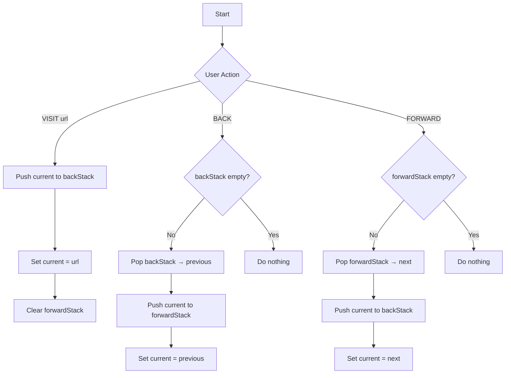

# Browser Navigation System - Implementation Plan

## Overview
- **Topic**: Browser Navigation System (Stack DS)
- **Tech**: Next.js 14 App Router, TypeScript, Tailwind, Shadcn UI
- **Deploy**: Vercel (zero config)
- **Repo**: `browser-nav-stack` on GitHub
- **All code + docs in single repo**

---

## Batch 1: Repo Init & Project Setup

### 1.1 Create GitHub Repo
```bash
gh repo create browser-nav-stack --public --description "Browser Navigation System - Stack DS Assignment"
cd /Users/hari/BrowserNav
git init
git remote add origin git@github.com:USERNAME/browser-nav-stack.git
```

### 1.2 Init Next.js Project
```bash
npx create-next-app@latest . --typescript --tailwind --eslint --app --src-dir --import-alias "@/*" --use-npm
```

### 1.3 Install Shadcn UI
```bash
npx shadcn@latest init
# Choose: Default (Slate), Yes to CSS variables, Yes to Tailwind CSS variables
```

### 1.4 Add Shadcn Components
```bash
npx shadcn@latest add button input card badge scroll-area separator
```

### 1.5 Create Screenshot Dir
```bash
mkdir -p public/screenshots
```

### 1.6 Initial Commit
```bash
git add .
git commit -m "init: next.js 14 + shadcn ui setup"
git push -u origin main
```

---

## Batch 2: Core App Logic

### 2.1 Create NavSimulator Component
**File**: `src/components/NavSimulator.tsx`

```typescript
'use client'

import { useState, useCallback } from 'react'
import { Button } from '@/components/ui/button'
import { Input } from '@/components/ui/input'
import { Card, CardContent, CardHeader, CardTitle } from '@/components/ui/card'
import { Badge } from '@/components/ui/badge'
import { ScrollArea } from '@/components/ui/scroll-area'
import { Separator } from '@/components/ui/separator'

export default function NavSimulator() {
  const [currentPage, setCurrentPage] = useState<string | null>(null)
  const [backStack, setBackStack] = useState<string[]>([])
  const [forwardStack, setForwardStack] = useState<string[]>([])
  const [inputUrl, setInputUrl] = useState('')
  const [error, setError] = useState('')

  // URL validation
  const isValidUrl = (url: string): boolean => {
    try {
      new URL(url)
      return true
    } catch {
      return false
    }
  }

  // VISIT operation
  const visit = useCallback((url: string) => {
    if (!url.trim()) {
      setError('URL cannot be empty')
      return
    }

    let finalUrl = url.trim()
    if (!finalUrl.startsWith('http://') && !finalUrl.startsWith('https://')) {
      finalUrl = 'https://' + finalUrl
    }

    if (!isValidUrl(finalUrl)) {
      setError('Invalid URL format')
      return
    }

    setError('')
    
    // Push current page to back stack if exists
    if (currentPage) {
      setBackStack(prev => [...prev, currentPage])
    }
    
    setCurrentPage(finalUrl)
    setForwardStack([]) // Clear forward stack on new visit
  }, [currentPage])

  // BACK operation
  const goBack = useCallback(() => {
    if (backStack.length === 0) return

    // Pop from back stack
    const newBackStack = [...backStack]
    const previousPage = newBackStack.pop()!

    // Push current to forward stack
    if (currentPage) {
      setForwardStack(prev => [...prev, currentPage])
    }

    setBackStack(newBackStack)
    setCurrentPage(previousPage)
  }, [backStack, currentPage])

  // FORWARD operation
  const goForward = useCallback(() => {
    if (forwardStack.length === 0) return

    // Pop from forward stack
    const newForwardStack = [...forwardStack]
    const nextPage = newForwardStack.pop()!

    // Push current to back stack
    if (currentPage) {
      setBackStack(prev => [...prev, currentPage])
    }

    setForwardStack(newForwardStack)
    setCurrentPage(nextPage)
  }, [forwardStack, currentPage])

  // CLEAR history
  const clearHistory = useCallback(() => {
    setBackStack([])
    setForwardStack([])
    setCurrentPage(null)
    setInputUrl('')
    setError('')
  }, [])

  // Handle Enter key
  const handleKeyDown = (e: React.KeyboardEvent) => {
    if (e.key === 'Enter') {
      visit(inputUrl)
      setInputUrl('')
    }
  }

  return (
    <div className="min-h-screen bg-background p-8">
      <div className="max-w-4xl mx-auto space-y-6">
        
        {/* Header */}
        <Card>
          <CardHeader>
            <CardTitle className="text-2xl font-bold text-center">
              Browser Navigation System
            </CardTitle>
            <p className="text-center text-muted-foreground">
              Stack Data Structure Simulation
            </p>
          </CardHeader>
        </Card>

        {/* URL Input */}
        <Card>
          <CardContent className="pt-6">
            <div className="flex gap-2">
              <Input
                placeholder="Enter URL (e.g., https://www.google.com)"
                value={inputUrl}
                onChange={(e) => {
                  setInputUrl(e.target.value)
                  setError('')
                }}
                onKeyDown={handleKeyDown}
                className="flex-1"
              />
              <Button onClick={() => {
                visit(inputUrl)
                setInputUrl('')
              }}>
                VISIT
              </Button>
            </div>
            {error && (
              <p className="text-sm text-red-500 mt-2">{error}</p>
            )}
          </CardContent>
        </Card>

        {/* Navigation Buttons */}
        <div className="flex gap-2 justify-center">
          <Button 
            variant="outline" 
            onClick={goBack}
            disabled={backStack.length === 0}
          >
            ← BACK
          </Button>
          <Button 
            variant="outline" 
            onClick={goForward}
            disabled={forwardStack.length === 0}
          >
            FORWARD →
          </Button>
          <Button 
            variant="destructive" 
            onClick={clearHistory}
          >
            CLEAR
          </Button>
        </div>

        {/* Current Page Display */}
        <Card>
          <CardHeader>
            <CardTitle className="text-lg">Current Page</CardTitle>
          </CardHeader>
          <CardContent>
            {currentPage ? (
              <Badge variant="default" className="text-base px-4 py-2">
                {currentPage}
              </Badge>
            ) : (
              <p className="text-muted-foreground">No page loaded</p>
            )}
          </CardContent>
        </Card>

        <div className="grid grid-cols-2 gap-6">
          {/* Back Stack Display */}
          <Card>
            <CardHeader>
              <CardTitle className="text-lg">
                Back Stack 
                <Badge variant="secondary" className="ml-2">
                  {backStack.length}
                </Badge>
              </CardTitle>
            </CardHeader>
            <CardContent>
              <ScrollArea className="h-48">
                {backStack.length === 0 ? (
                  <p className="text-muted-foreground text-sm">Empty</p>
                ) : (
                  <div className="space-y-2">
                    {[...backStack].reverse().map((url, idx) => (
                      <div key={idx} className="flex items-center gap-2">
                        <Badge variant="outline" className="text-xs">
                          {backStack.length - idx}
                        </Badge>
                        <span className="text-sm truncate">{url}</span>
                      </div>
                    ))}
                  </div>
                )}
              </ScrollArea>
            </CardContent>
          </Card>

          {/* Forward Stack Display */}
          <Card>
            <CardHeader>
              <CardTitle className="text-lg">
                Forward Stack
                <Badge variant="secondary" className="ml-2">
                  {forwardStack.length}
                </Badge>
              </CardTitle>
            </CardHeader>
            <CardContent>
              <ScrollArea className="h-48">
                {forwardStack.length === 0 ? (
                  <p className="text-muted-foreground text-sm">Empty</p>
                ) : (
                  <div className="space-y-2">
                    {[...forwardStack].reverse().map((url, idx) => (
                      <div key={idx} className="flex items-center gap-2">
                        <Badge variant="outline" className="text-xs">
                          {forwardStack.length - idx}
                        </Badge>
                        <span className="text-sm truncate">{url}</span>
                      </div>
                    ))}
                  </div>
                )}
              </ScrollArea>
            </CardContent>
          </Card>
        </div>

        {/* Stack Visualization (LIFO) */}
        <Card>
          <CardHeader>
            <CardTitle className="text-lg">Stack Operations (LIFO)</CardTitle>
          </CardHeader>
          <CardContent>
            <div className="grid grid-cols-2 gap-4 text-sm">
              <div>
                <p className="font-semibold mb-2">Back Stack (Top → Bottom):</p>
                <Separator className="mb-2" />
                {backStack.length === 0 ? (
                  <p className="text-muted-foreground">[Empty]</p>
                ) : (
                  <code className="text-xs">
                    [{backStack[backStack.length - 1] || 'top'}, ..., {backStack[0] || 'bottom'}]
                  </code>
                )}
              </div>
              <div>
                <p className="font-semibold mb-2">Forward Stack (Top → Bottom):</p>
                <Separator className="mb-2" />
                {forwardStack.length === 0 ? (
                  <p className="text-muted-foreground">[Empty]</p>
                ) : (
                  <code className="text-xs">
                    [{forwardStack[forwardStack.length - 1] || 'top'}, ..., {forwardStack[0] || 'bottom'}]
                  </code>
                )}
              </div>
            </div>
          </CardContent>
        </Card>

      </div>
    </div>
  )
}
```

### 2.2 Update Main Page
**File**: `src/app/page.tsx`

```typescript
import NavSimulator from '@/components/NavSimulator'

export default function Home() {
  return <NavSimulator />
}
```

### 2.3 Update Layout (optional styling)
**File**: `src/app/layout.tsx` - keep default, ensure fonts loaded

### 2.4 Commit
```bash
git add .
git commit -m "feat: implement browser navigation simulator with stack DS"
git push
```

---

## Batch 3: Documentation

### 3.1 Create REPORT.md (9-Section Assignment Doc)

**File**: `REPORT.md`

```markdown
# Browser Navigation System - Technical Report

## 1. Title Page
**Project Title**: Browser Navigation System  
**Topic**: Stack Data Structure Implementation  
**Course**: [Course Name]  
**Group Members**:
- Member 1: [Name] (Roll No: [XXX])
- Member 2: [Name] (Roll No: [XXX])
- Member 3: [Name] (Roll No: [XXX])  
**Date**: 2026-05-02  
**Instructor**: [Instructor Name]

---

## 2. Problem Statement
Design and implement a system to simulate web browser navigation history using stack data structures. The system should allow users to visit web pages, navigate backward through their history, and move forward to previously visited pages. This simulation demonstrates the Last-In-First-Out (LIFO) behavior of stack data structures in a real-world scenario.

---

## 3. Objectives
1. Understand and implement stack data structures in TypeScript
2. Simulate browser navigation behavior (back/forward)
3. Create a user-friendly GUI using React and Shadcn UI
4. Demonstrate proper stack operations (push, pop)
5. Validate user inputs and handle edge cases
6. Deploy the application to a cloud platform (Vercel)

---

## 4. System Design / Approach

### 4.1 Representation of Input
- **URL Input**: String representing web page URL
- **Validation**: Must be non-empty, valid URL format (http/https)
- **Auto-correction**: Adds `https://` prefix if missing

### 4.2 Data Structures Used
**Stack (LIFO - Last In First Out)**
- **Back Stack**: Stores history of visited pages for backward navigation
- **Forward Stack**: Stores pages for forward navigation after going back

```typescript
// Stack implementation using TypeScript arrays
type Stack = string[]
let backStack: Stack = []
let forwardStack: Stack = []
```

**Stack Operations**:
- `push(item)`: Add to end of array
- `pop()`: Remove from end of array
- `peek()`: View last item without removing

### 4.3 Overall Logic Flow



### 4.4 Block Diagram
```
+-------------------+
|   User Interface  |
| (URL Input, Btns) |
+---------+---------+
          |
          v
+-------------------+
|  NavSimulator     |
|  (State Manager)  |
+---------+---------+
          |
    +-----+-----+
    |           |
    v           v
+---+---+   +---+---+
| Back  |   |Forward|
| Stack |   | Stack |
+-------+   +-------+
```

---

## 5. Implementation Details

### 5.1 Programming Language
- **Frontend**: TypeScript (strict mode)
- **Framework**: Next.js 14 (App Router)
- **Styling**: Tailwind CSS
- **UI Library**: Shadcn UI (Radix UI primitives)

### 5.2 Key Functions/Modules

#### visit(url: string)
```typescript
const visit = (url: string) => {
  if (currentPage) {
    setBackStack(prev => [...prev, currentPage]) // Push to back stack
  }
  setCurrentPage(url)
  setForwardStack([]) // Clear forward stack (new branch)
}
```

#### goBack()
```typescript
const goBack = () => {
  if (backStack.length === 0) return
  const newBackStack = [...backStack]
  const previousPage = newBackStack.pop()! // Pop from back stack
  if (currentPage) {
    setForwardStack(prev => [...prev, currentPage]) // Push to forward
  }
  setBackStack(newBackStack)
  setCurrentPage(previousPage)
}
```

#### goForward()
```typescript
const goForward = () => {
  if (forwardStack.length === 0) return
  const newForwardStack = [...forwardStack]
  const nextPage = newForwardStack.pop()! // Pop from forward stack
  if (currentPage) {
    setBackStack(prev => [...prev, currentPage]) // Push to back
  }
  setForwardStack(newForwardStack)
  setCurrentPage(nextPage)
}
```

### 5.3 Important Logic Discussion
1. **Stack Clearing**: When visiting a new URL after going back, the forward stack must be cleared (browser behavior)
2. **LIFO Order**: Stack displays show top element first (reverse array for display)
3. **State Updates**: Use functional state updates to avoid stale closures
4. **URL Validation**: Auto-prefix `https://` if missing, validate with `new URL()`

---

## 6. Sample Input and Output

### Test Case 1: Basic Navigation
**Input**:
1. VISIT https://www.google.com
2. VISIT https://www.youtube.com
3. BACK
4. FORWARD

**Output**:
- After step 1: Current Page = https://www.google.com
- After step 2: Current Page = https://www.youtube.com, Back Stack = [google.com]
- After step 3: Current Page = https://www.google.com, Forward Stack = [youtube.com]
- After step 4: Current Page = https://www.youtube.com, Back Stack = [google.com]

### Test Case 2: Stack State Display
**Input**:
1. VISIT page1.com
2. VISIT page2.com
3. VISIT page3.com
4. BACK
5. BACK

**Stack States**:
- Back Stack (top→bottom): [page2.com, page1.com]
- Forward Stack (top→bottom): [page3.com]
- Current Page: page1.com

---

## 7. Result and Conclusion

### Achievements
1. Successfully implemented browser navigation using stack data structures
2. Created an intuitive GUI with real-time stack visualization
3. Demonstrated LIFO behavior through back/forward operations
4. Properly handled edge cases (empty stacks, invalid URLs)
5. Deployed to Vercel with zero configuration

### Learning Outcomes
1. **Stack DS Mastery**: Understood push/pop operations in real-world context
2. **React State Management**: Managed complex state with useState and useCallback
3. **UI/UX Design**: Built accessible interface with Shadcn UI components
4. **TypeScript**: Applied type safety to prevent runtime errors
5. **Cloud Deployment**: Experienced seamless deployment with Vercel

---

## 8. Limitations
1. **No Persistence**: History lost on page refresh (no localStorage/sessionStorage)
2. **No Actual Browsing**: Only simulates navigation, doesn't load real pages
3. **Single Session**: No multiple tab support
4. **Memory**: Large history could impact performance (no size limit implemented)
5. **No Bookmarks**: Feature not implemented

---

## 9. References
1. **Textbooks**:
   - "Data Structures and Algorithms in TypeScript" - [Author]
   - "React Documentation" - https://react.dev
   - "Next.js Documentation" - https://nextjs.org/docs

2. **Online Resources**:
   - Shadcn UI: https://ui.shadcn.com
   - Tailwind CSS: https://tailwindcss.com
   - Vercel Deployment: https://vercel.com/docs
   - Stack Data Structure: https://www.geeksforgeeks.org/stack-data-structure/

3. **MDN Web Docs**:
   - URL API: https://developer.mozilla.org/en-US/docs/Web/API/URL
   - React Hooks: https://react.dev/reference/react
```

### 3.2 Create README.md

**File**: `README.md`

```markdown
# Browser Navigation System

A Next.js application simulating browser back/forward navigation using Stack data structures. Built with TypeScript, Shadcn UI, and deployed on Vercel.

## Features
- ✅ Stack-based navigation (Back/Forward)
- ✅ URL validation and auto-correction
- ✅ Real-time stack visualization
- ✅ Clean UI with Shadcn components
- ✅ Responsive design
- ✅ One-click Vercel deployment

## Tech Stack
- **Framework**: Next.js 14 (App Router)
- **Language**: TypeScript
- **Styling**: Tailwind CSS
- **UI**: Shadcn UI
- **Deployment**: Vercel

## Getting Started

### Prerequisites
- Node.js 18+
- npm/yarn/pnpm

### Installation
```bash
git clone https://github.com/USERNAME/browser-nav-stack.git
cd browser-nav-stack
npm install
npm run dev
```

Open [http://localhost:3000](http://localhost:3000)

## Usage
1. Enter a URL in the input field
2. Click "VISIT" or press Enter
3. Use "BACK" and "FORWARD" buttons to navigate
4. View stack states in real-time
5. Use "CLEAR" to reset all history

## Deployment
[](https://vercel.com/new/clone?repository-url=https://github.com/USERNAME/browser-nav-stack)

Or push to GitHub and import to Vercel for zero-config deployment.

## Screenshots


## Assignment Compliance
- ✅ Problem understanding and DS implementation (1 Mark)
- ✅ Functionality, organization, completeness (3 Marks)
- ✅ User interface and usability (2 Marks)
- ✅ Documentation (REPORT.md) (4 Marks)

## License
MIT
```

### 3.3 Take Screenshots
```bash
# After running npm run dev, take screenshots:
# 1. Main interface with empty state
# 2. After visiting 2-3 URLs
# 3. Stack visualization
# Save to public/screenshots/
```

### 3.4 Commit Docs
```bash
git add REPORT.md README.md public/screenshots/
git commit -m "docs: add assignment report and readme"
git push
```

---

## Batch 4: Deployment

### 4.1 Push All to GitHub
```bash
git status
git add .
git commit -m "feat: complete browser navigation system with docs"
git push origin main
```

### 4.2 Deploy to Vercel
1. Go to [vercel.com](https://vercel.com)
2. Click "New Project"
3. Import `browser-nav-stack` repo
4. Vercel auto-detects Next.js (zero config)
5. Click "Deploy"
6. Copy deployment URL

### 4.3 Update README with Deploy Badge
```bash
# After deploy, get URL and update README.md
# Add: [](https://your-app.vercel.app)
```

### 4.4 Final Commit
```bash
git add README.md
git commit -m "docs: add vercel deploy badge"
git push
```

---

## File Structure
```
browser-nav-stack/
├── src/
│   ├── app/
│   │   ├── layout.tsx
│   │   ├── page.tsx
│   │   └── globals.css
│   └── components/
│       └── NavSimulator.tsx
├── public/
│   └── screenshots/
│       ├── main.png
│       └── stacks.png
├── REPORT.md
├── README.md
├── package.json
├── tsconfig.json
├── tailwind.config.ts
└── next.config.mjs
```

---

## Evaluation Checklist
- [x] Stack DS properly implemented (backStack, forwardStack)
- [x] VISIT/BACK/FORWARD operations working
- [x] URL validation (non-empty, valid format)
- [x] User-friendly GUI (Shadcn UI)
- [x] Stack visualization (LIFO order)
- [x] Clear history function
- [x] REPORT.md (9 sections)
- [x] README.md with setup/deploy steps
- [x] Deployed on Vercel
- [x] Screenshots included
